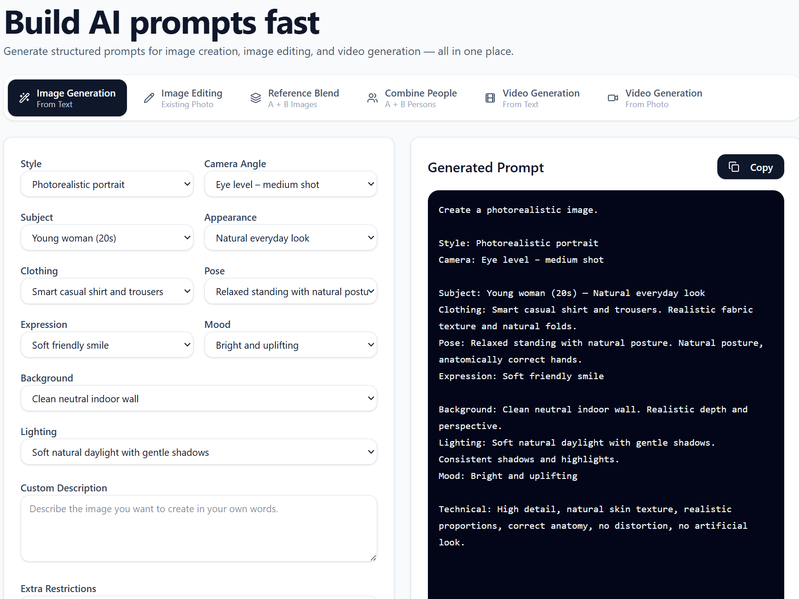
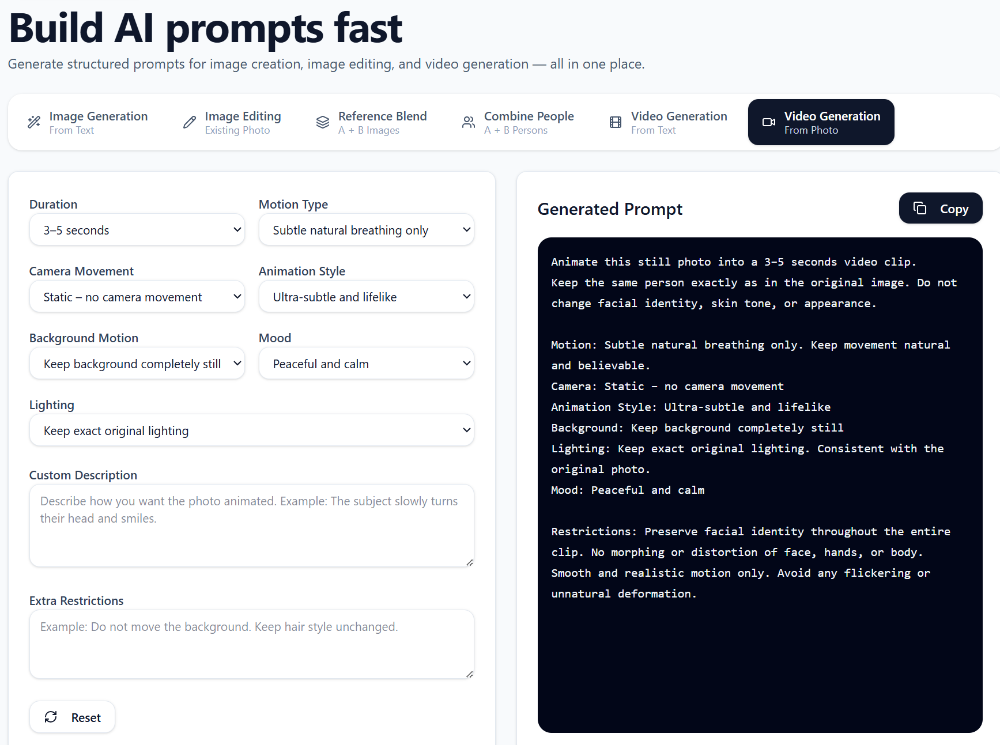
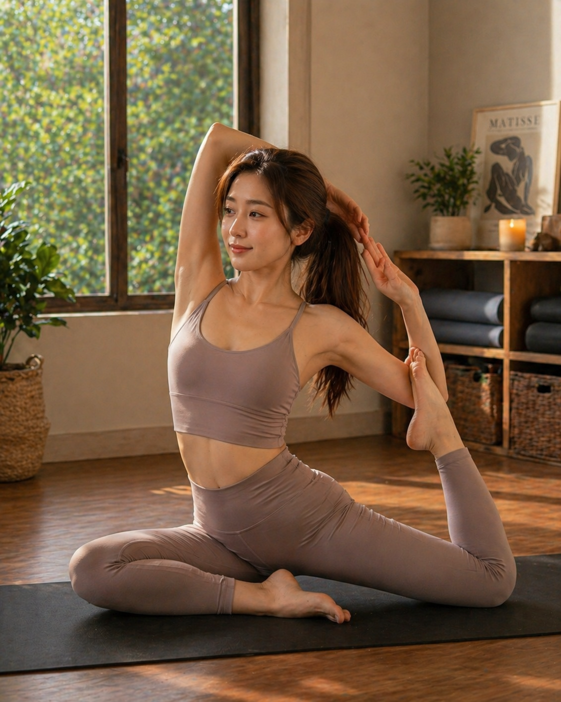
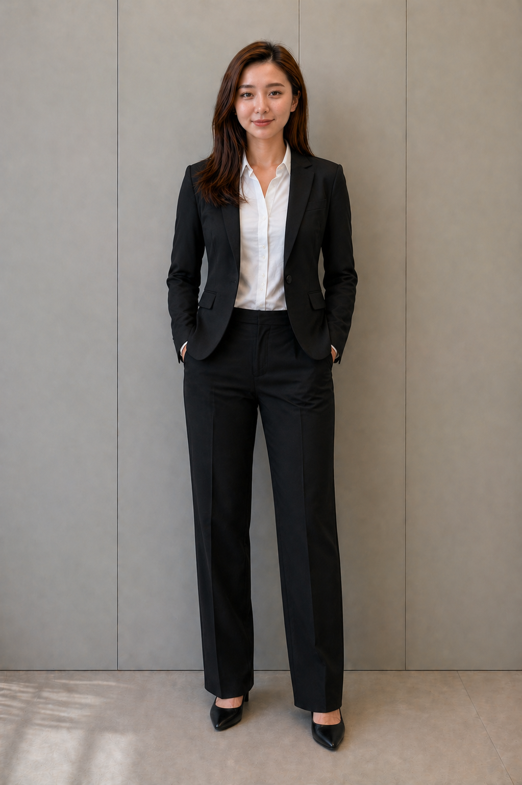
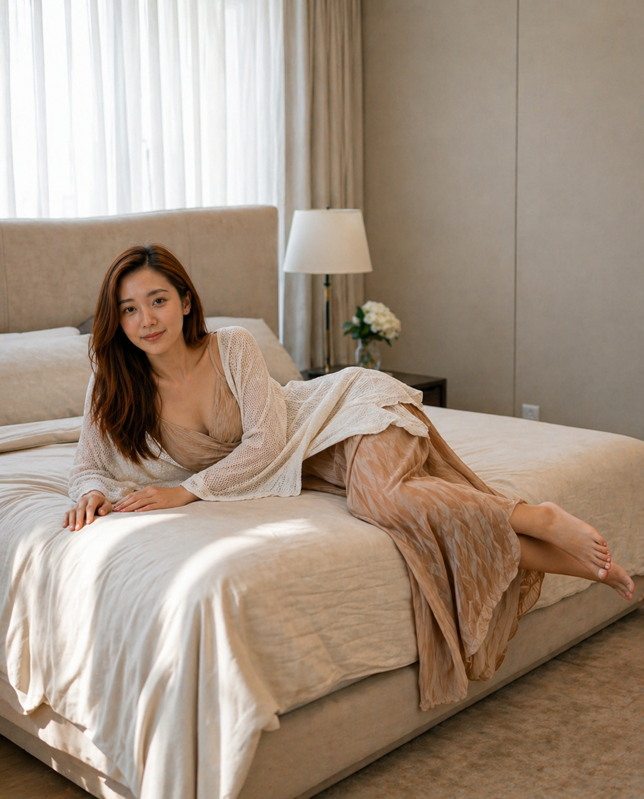

# AI Prompt Builder

Generate structured, ready-to-use prompts for AI image creation, image editing, and video generation — all in one place.

**🌐 Live site: [https://admin-pss.github.io/ai-prompt-builder/](https://admin-pss.github.io/ai-prompt-builder/)**




---

## What it does

Instead of writing prompts from scratch, you pick your options from dropdowns and the app assembles a detailed, structured prompt you can copy straight into any AI image or video tool (ChatGPT, Midjourney, Flux, DALL-E, Kling, Runway, and others).

### Six tabs

| Tab | What it builds |
|---|---|
| **Image Generation** | Text-to-image prompt — style, camera, subject, clothing, pose, expression, mood, background, lighting |
| **Image Editing** | Edit an existing photo — frame expansion, body adjustment, 25 poses, clothing, makeup, face treatment, background, lighting |
| **Reference Blend** | Two-image workflow — preserve identity from Image A, apply pose/outfit/background/makeup from Image B |
| **Combine People** | Merge two people — side by side, face swap, pose transfer, outfit transfer, interaction, background swap, or hybrid blend |
| **Video Generation (Text)** | Text-to-video prompt — duration, style, subject, action, camera movement, mood, background, lighting |
| **Video Generation (Photo)** | Animate a still photo — motion type, camera movement, animation style, background motion, lighting, mood |

---

## Example outputs

These images were generated in **ChatGPT (GPT-image-2)** using prompts built with this tool.

<table>
  <tr>
    <td align="center"><br/><sub>Yoga pose · athletic wear · golden hour studio</sub></td>
    <td align="center"><br/><sub>Business suit · full body · neutral background</sub></td>
    <td align="center"><br/><sub>Lifestyle · luxury bedroom · cinematic lighting</sub></td>
  </tr>
</table>

---

## Getting started

```bash
# 1. Clone the repo
git clone https://github.com/your-username/ai-prompt-builder.git
cd ai-prompt-builder

# 2. Install dependencies
npm install

# 3. Run locally
npm run dev
```

Open [http://localhost:5173](http://localhost:5173) in your browser.

### Build for production

```bash
npm run build
```

---

## Stack

- **React 19** — UI and state
- **Vite** — build tool and dev server
- **Tailwind CSS v4** — styling
- **Framer Motion** — tab and UI animations
- **Lucide React** — icons

No backend. No API keys. Runs entirely in the browser.

---

## Prompts & content

The prompt reference guides (`Prompts_*.md`) included in this repo were developed with the help of **ChatGPT**. They cover:

- Pose library (25 poses across 7 categories)
- Body editing techniques
- Makeup by context and event
- Face realism and de-aging
- Frame and body expansion
- Hands and legs vocabulary
- Base and reference image workflows
- Combining two people (7 scenarios)

The example output images in `public/` were also generated in **ChatGPT** using prompts assembled with this tool.

---

## Extending the app

**Add a dropdown to an existing tab:**
1. Add the key + options array to that tab's `options` object
2. Add the default value to that tab's `default` state object
3. Add a `<SelectBlock>` in the tab's form panel
4. Reference the field in that tab's `useMemo` prompt template

**Add a new tab:**
1. Add an entry to the `TABS` array
2. Create options / default / form panel / `useMemo` for it
3. Add the branch to `activePrompt` and `handleReset`

---

## License

MIT
